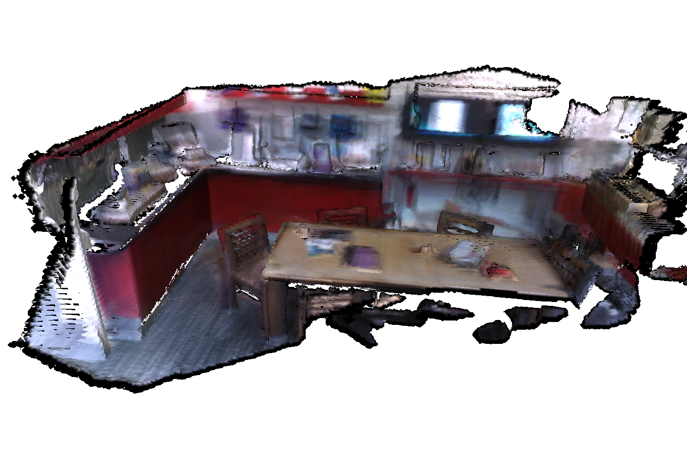

# Volumetric Fusion



An implementation of Volumetric TSDF fusion in pure numpy for pedagogical purposes.

## Installation

1. Create conda env and install dependencies.

```bash
conda create -n fusion python=3.8
conda activate fusion
pip install --upgrade pip
pip install -r requirements.txt
```

2. Run

```bash
python main.py --path <path/to/your/dataset/>
```